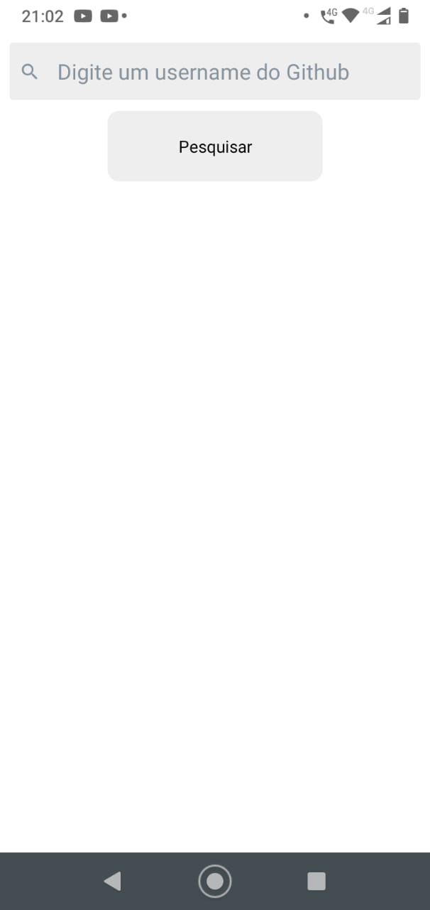
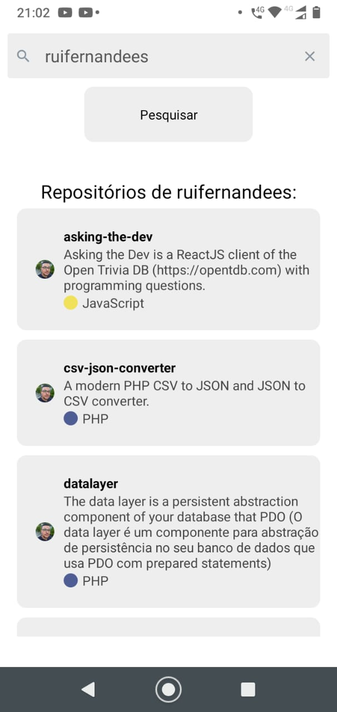

# Teste React Native + Github API
## Rodar o projeto na sua máquina
```bash
$ git clone https://github.com/ruifernandees/teste-rn-githubapi.git
$ cd teste-rn-githubapi
$ yarn install
$ yarn start
```
## Prints 
### (Tela inicial - Lista de repositórios - Usuário não encontrado):


